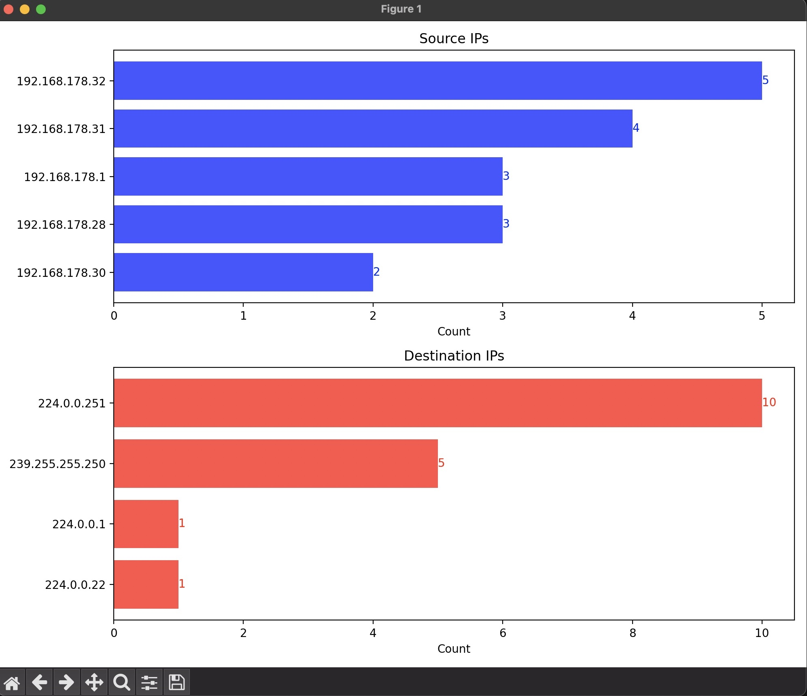
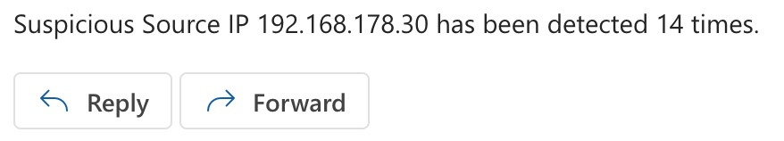
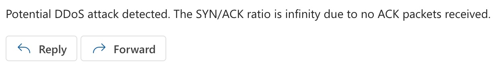
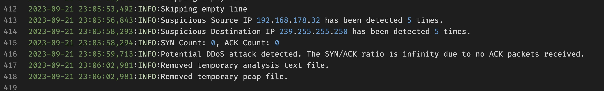

# Packet Analysis Script

## Table of Contents

- [Packet Analysis Script](#packet-analysis-script)
  - [Table of Contents](#table-of-contents)
  - [Overview](#overview)
    - [Use Cases](#use-cases)
  - [Features](#features)
  - [Email Alerts](#email-alerts)
    - [Configuring Email](#configuring-email)
  - [Requirements](#requirements)
  - [Installation](#installation)
  - [Execution](#execution)
  - [Logging](#logging)
  - [Troubleshooting](#troubleshooting)

## Overview

This script is developed to serve as a comprehensive solution for network security through meticulous packet analysis. It aims to assist network administrators and security professionals in monitoring, analyzing, and securing network traffic by providing real-time insights into network activities and alerting them to potential threats.

### Use Cases

- **Network Monitoring**: Regularly scrutinizing network packets to identify any unusual patterns or activities.
- **Security Enforcement**: Enabling swift detection and response to potential security threats, thereby enhancing network security.

## Features

- **Enhanced Packet Analysis**: Extracts and analyzes source and destination IPs along with TCP flag types.
- **Dynamic Thresholding**: Utilizes dynamic thresholding for identifying suspicious IPs based on statistical deviations.
- **DDoS Detection**: Employs SYN/ACK ratio analysis to detect potential DDoS attacks.
- **Email Alerts**: Sends email notifications when suspicious activity is detected.
- **Data Visualization**: Generates histograms of source and destination IPs.
- **Customizable Command-line Parameters**: Allows customization via command-line arguments.



## Email Alerts

The script has a built-in email alert system that uses SMTP to send notifications for suspicious IPs or attack patterns. If the same IP address appears more times than a specified threshold or if certain attack patterns are detected, the script sends an email alert to a predefined email address.




### Configuring Email

environment variables. They are as follows:

- SMTP_SERVER: SMTP server address.
- SMTP_PORT: SMTP server port, typically 587 for TLS.
- SMTP_USERNAME: Email username.
- SMTP_PASSWORD: Email password.

These configurations need to be set in a .env file located in the project directory.

example:

    MTP_USERNAME=example@example.com
    SMTP_PASSWORD=secretpassword
    SMTP_SERVER=smtp.office365.com
    SMTP_PORT=587

And set inside code from_email and to_email:

```python
def send_email(subject: str, message: str) -> None:
    try:
        from_email = "example@example.com"
        to_email = "example2@gmail.com"
```

Ensure to update these details before running the script.

## Requirements

- Python 3.x
- tshark
- matplotlib
- smtplib
- logging
- email
- subprocess
- collections
- logging
- argparse
- numpy
- dotenv

## Installation

To install the required Python libraries, use the following command:

```bash
pip install matplotlib numpy python-dotenv
```

## Execution

To run the script, use the following command:

```bash
python packetanalyzer.py --interface en0 --count 50
```

Parameters:

    --interface: Specifies the network interface for capturing packets (default is en0).
    --count: Determines the number of packets to capture (default is 50).

## Logging

The script incorporates a logging system to monitor its operation, record any issues encountered, and keep track of suspicious activities identified. The log messages are stored in `packet_analysis.log` located in the project directory.

Here is how logging is configured within the script:

```python
logging.basicConfig(filename='packet_analysis.log', level=logging.INFO,
                    format='%(asctime)s:%(levelname)s:%(message)s')
```



## Troubleshooting

- **Permission Issues**: Ensure you have the necessary administrative permissions to run packet capture on the specified network interface.
- **Email Configuration**: Verify that the SMTP details and email addresses are correctly configured in the script and the .env file.
- **Dependency Installation**: Make sure all the required Python libraries and tshark are correctly installed.
